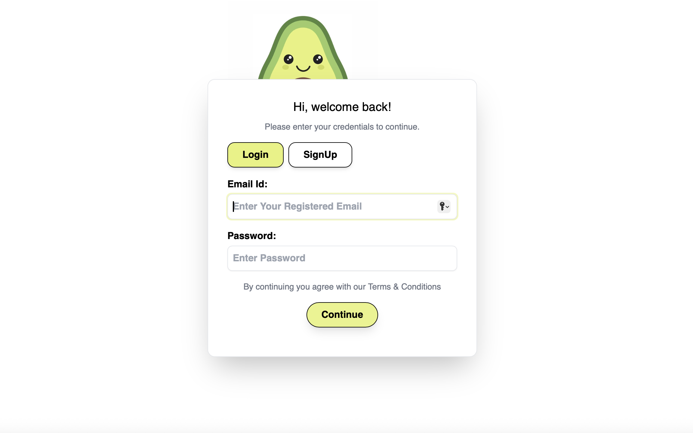
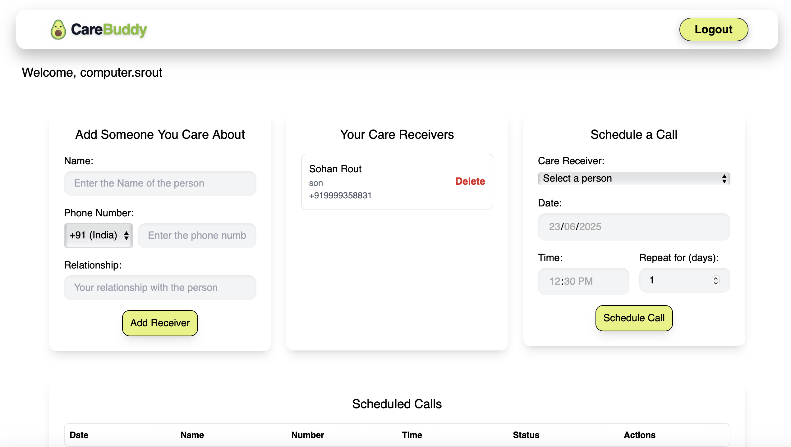
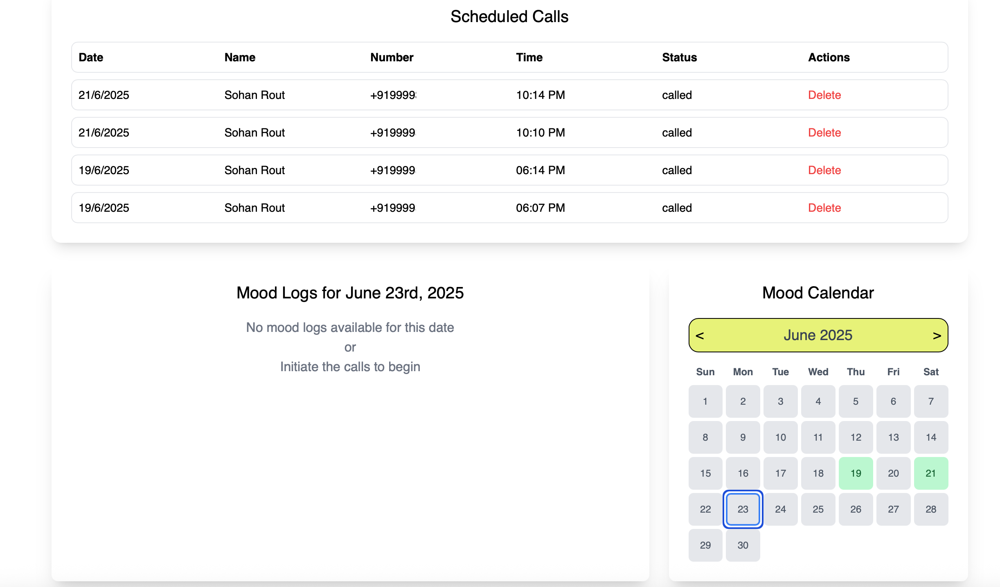
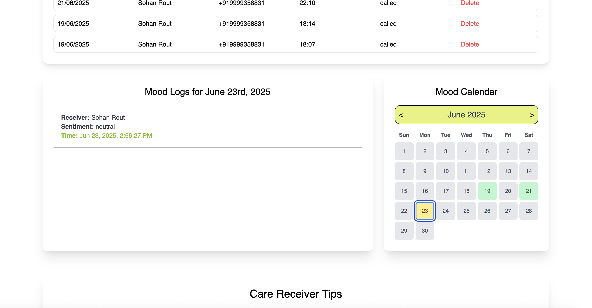
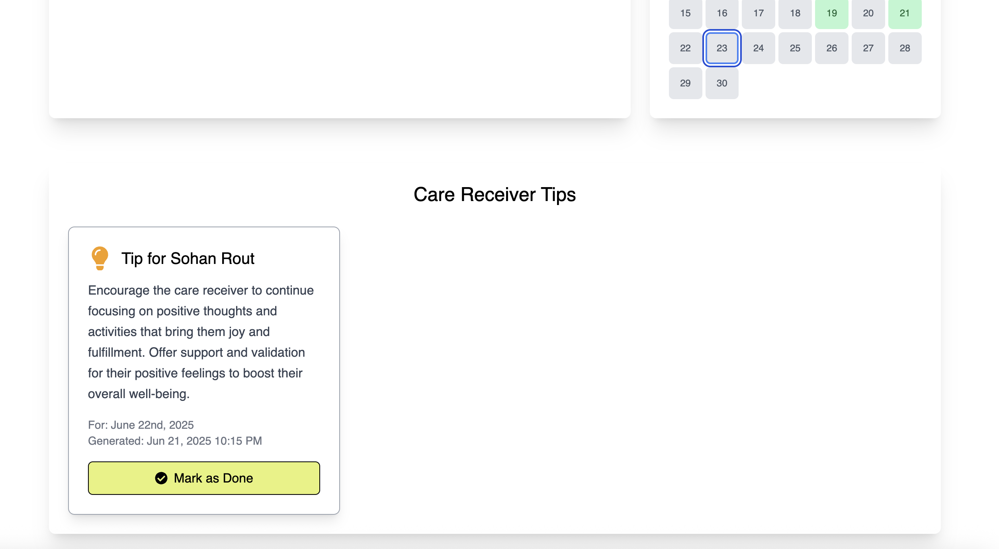

  

<h1 align="center">CareBuddy</h1>

## 💙 About CareBuddy

**CareBuddy** is a voice-based emotional wellness assistant designed to help people stay connected with the emotional state of their loved ones. Through scheduled calls, mood tracking, and real-time sentiment analysis, CareBuddy ensures your care is always heard and felt.

---

## 🎧 Listen to a Demo Call

<audio controls>
  <source src="https://github.com/your-username/CareBuddy/raw/main/public/demoImg/record-1750670738995.mp3" type="audio/mpeg">
  Your browser does not support the audio element.
</audio>

> 🎵 If the audio player doesn't load in your browser, [click here to listen on Google Drive](https://drive.google.com/file/d/1NQE8AvFKqU-aTzNcQOWmZROANqTSSl6X/view?usp=share_link).

---

## 📱 App Walkthrough

Below is a visual walkthrough of the CareBuddy application.

### 🔐 Auth Page

### 📊 Dashboard Overview
#### 📅 Schedule a Call

#### 📆 Mood Calendar

### 📋 Tips For Users

---

## 🚧 Future Work

We’re excited to expand CareBuddy with the following upcoming features:

- 🧠 Conversational AI integration for more natural interactions with care receivers.
- 📞 Real-time emergency contact calling for urgent alerts based on mood analysis.
- ⚡ Smoother in-app transitions and scheduling actions.
- 🌐 Multilingual support to reach a broader audience.

---

## ⚠️ Disclaimer
Due to Twilio’s current trial account limitations, calls can only be made to verified phone numbers. Forwarding or dialing unverified numbers is currently restricted until KYC (Know Your Customer) verification is completed.